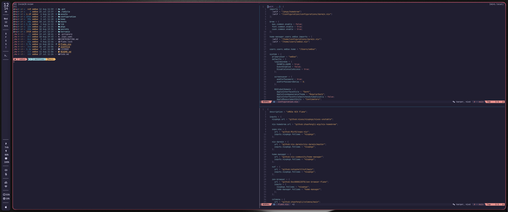

# This Is My Personal macOS Configuration

## Installation Instructions

> [!WARNING]
> You have to give Terminal full disk access before executing.

```zsh
git clone https://github.com/xM0Se/dotfiles.git
```

```zsh
cd dotfiles
```

```zsh
curl --proto '=https' --tlsv1.2 -sSf -L https://install.determinate.systems/nix | sh -s -- install --no-confirm
```

```zsh
. /nix/var/nix/profiles/default/etc/profile.d/nix-daemon.sh
```

```zsh
sudo nix run nix-darwin#darwin-rebuild -- switch --flake ~/dotfiles#dMACOS
```

Afterward you can use `j build` when in the dotfiles directory

## Screenshots:


